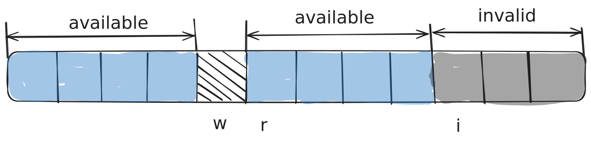

# LFBB - Lock Free Bipartite Buffer


LFBB is a bipartite buffer implementation written in standard C11, suitable for all platforms, from deeply embedded to HPC uses. It is lock-free for single consumer single producer scenarios making it incredibly performant and easy to use.

## What is a bipartite buffer

A bipartite buffer is a variation of the classic [ring buffer](https://en.wikipedia.org/wiki/Circular_buffer) with the ability to always be able to provide the user with contiguous memory regions for writing/reading if there is enough space/data.

## Why use a bipartite buffer
A bipartite buffer should be used everywhere a ring buffer is used if you want:
* To offload transfers to DMA increasing the transfer speed and freeing up CPU time
* To avoid creating intermediate buffers for APIs that require contiguous data
* To process data inside the buffer without dequeueing it
* For scenarios where operations on data might fail or only some data might be used

## Features
* Written in standard C11, compatible with all platforms supporting it
* Lock free thread and multicore safe in single producer single consumer scenarios
* No dynamic allocation
* Optimized for high performance
* MIT Licensed

## How to get
There are three main ways to get the library:
* Using CMake [FetchContent()](https://cmake.org/cmake/help/latest/module/FetchContent.html)
* As a [git submodule](https://git-scm.com/book/en/v2/Git-Tools-Submodules)
* By downloading a release from GitHub

## How to use
Shown here is an example of typical use:
* Consumer thread/interrupt
```c
size_t data_available;
uint8_t *read_ptr = LFBB_ReadAcquire(&lfbb_adc, &data_available);

if (read_ptr != NULL) {
    size_t data_used = DoStuffWithData(read_ptr, data_available);
    LFBB_ReadRelease(&lfbb_adc, data_used);
}
```

* Producer thread/interrupt
```c
if (!write_started) {
    uint8_t *write_ptr = LFBB_WriteAcquire(&lfbb_adc, sizeof(data));
    if (write_ptr != NULL) {
        ADC_StartDma(&adc_dma_h, write_ptr, sizeof(data));
        write_started = true;
    }
} else {
    if (ADC_PollDmaComplete(&adc_dma_h) {
        LFBB_WriteRelease(&lfbb_adc, sizeof(data));
        write_started = false;
    }
}
```

## Configuration
The library offers two configuration defines ```LFBB_MULTICORE_HOSTED``` and ```LFBB_CACHELINE_LENGTH``` that can be passed by the build system or defined before including the library if the configuration isn't suitable.

On embedded systems it is usually required to do manual cache synchronization, so ```LFBB_MULTICORE_HOSTED``` should be left as ```false``` to avoid wasting space on padding for cacheline alignment of indexes.

For hosted systems the [False Sharing](https://en.wikipedia.org/wiki/False_sharing) phenomenom can reduce performance to some extent which is why passing ```LFBB_MULTICORE_HOSTED``` as ```true``` is advisable. This aligns the indexes to the system cacheline size, ```64``` by default.

Some systems have a non-typical cacheline length (for instance the apple M1/M2 CPUs have a cacheline length of 128 bytes), and ```LFBB_CACHELINE_LENGTH``` should be set accordingly in those cases.

## How it works
The Bipartite Buffer uses the same base principle as the [ring buffer data structure](https://en.wikipedia.org/wiki/Circular_buffer), however its ability to provide contiguous space for writing and reading requires modifying the approach slightly.

Let's consider a typical usage scenario, we want to acquire 4 slots for writing in the following buffer:

<p align="center" width="100%">
    
</p>

We have 7 free slots, so this would work fine for a regular ring buffer.
However when we unroll the buffer we can notice the issue:

<p align="center" width="100%">
    
</p>

We cannot acquire 4 slots from the start of the free space, as there is not enough contiguous space until the end of the buffer, and the only solution is to acquire 4 slots from the beginning.

After acquiring those slots, we have a gap in available data caused by the skip and we must somehow tell the buffer to avoid reading from that region:

<p align="center" width="100%">
    
</p>

This is where we introduce another index - the **invalidate index** ``i``.
We can set it to the start of the region we want to skip, and next time we are reading the data, we only consider data until the invalidate index.

<p align="center" width="100%">
    
</p>

Now the first time we acquire data for reading, we will get the region from `r` to `i`:

<p align="center" width="100%">
    
</p>

And the next time we will acquire the region from `0` to `w`:

<p align="center" width="100%">
    
</p>

Lastly, when writing, we can write over invalidated parts of the buffer as it doesn't contain anything useful, but also have to move the invalidate index:

<p align="center" width="100%">
    
</p>

For more details, [here](https://www.codeproject.com/Articles/3479/The-Bip-Buffer-The-Circular-Buffer-with-a-Twist) is a nice writeup about Bipartite Buffers.

## Dealing with caches on embedded systems
When using the library with DMA or asymmetric multicore on embedded systems with cache it is necessary to perform manual cache synchronization in one of the following ways:
* Using platform specific data synchronization barriers (```DSB``` on ARM)
* By manually invalidating cache
* By setting the MPU/MMU up to not cache the data buffer

## Caveats
* The library does not implement alignment of writes and reads, it is up to the user to only write in factors they want the data to be aligned to, adequately size and align the buffer used
